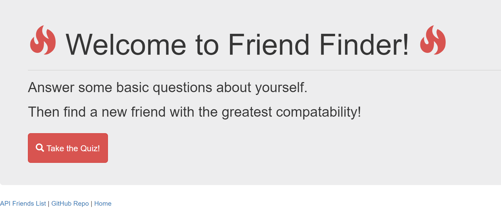
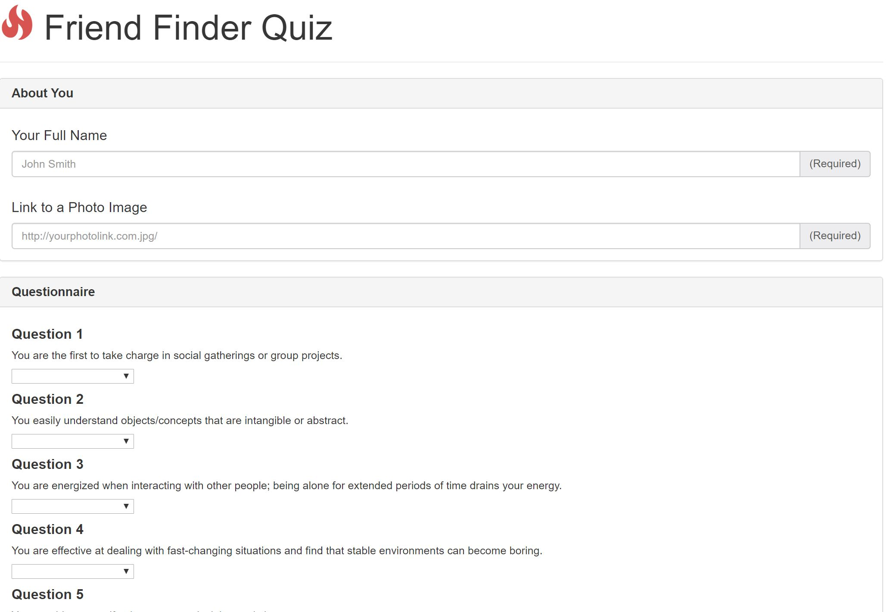
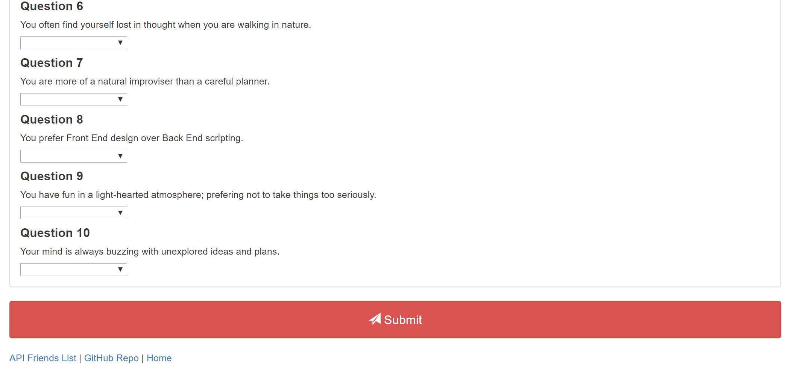

# FriendFinder
 This full-stack site will take in results from your users' surveys, 
then compare their answers with those from other users.
The app will then display the name and picture of the user with the best overall match. 
Please install required npm packages to check how this app works.
npm packages used:npm express,npm body-parser,npm path.
Here are the images of the FriendFinder Homepage,Surveypage and Result page.
Homepage:

Surveypage:

Surveypage and Submit button:

Result:

